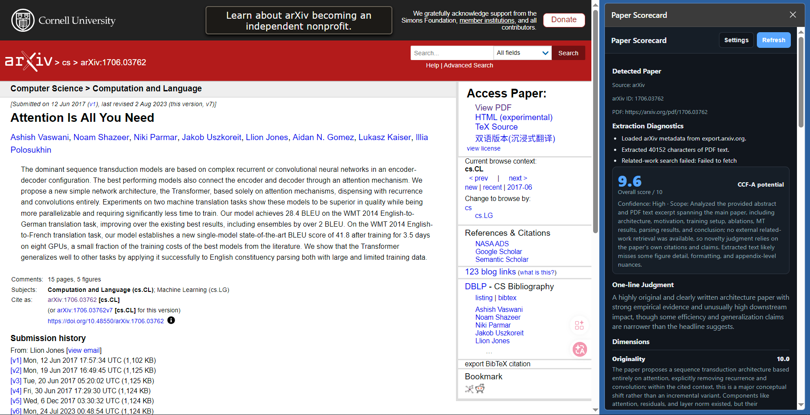

# Paper Scorecard

AI reviewer sidebar scorecards for arXiv papers, with PDF text extraction and related-work search.

Language: [English](#english) | [简体中文](#简体中文)

> Generated by Codex AI.

## English

Paper Scorecard is an open-source browser extension prototype that shows an AI reviewer scorecard for arXiv papers in the browser sidebar.

It is designed for paper triage: helping readers quickly judge whether a paper deserves deep reading, monitoring, or skipping. It does not replace peer review.

### Preview



### Features

- Runs on `https://arxiv.org/abs/*` and `https://arxiv.org/pdf/*`.
- Uses the native Chrome/Edge browser sidebar through the `sidePanel` API.
- Extracts arXiv title, authors, abstract, subjects, comments, PDF link, and PDF text.
- Reviews PDF text using bundled [PDF.js](https://github.com/mozilla/pdf.js).
- Searches arXiv related work and uses retrieved papers to judge novelty and theoretical value.
- Uses a user-configured OpenAI Responses, OpenAI Chat Completions, or Claude Messages compatible API.
- Supports multilingual review output from settings.
- Supports auto, light, and dark theme rendering.
- Caches generated reviews locally by arXiv ID.
- Optionally caches extracted PDF text locally.

### Review Rubric And Sources

The scorecard uses seven core dimensions adapted from the [Stanford Agentic Reviewer Tech Overview](https://paperreview.ai/tech-overview):

1. Originality
2. Research Question Importance
3. Claims Support
4. Experiment Soundness
5. Writing Clarity
6. Value to Research Community
7. Prior Work Contextualization

The implementation also follows reviewer-quality guidance from:

- [Stanford Agentic Reviewer](https://paperreview.ai/) and its [technical overview](https://paperreview.ai/tech-overview): agentic review workflow, arXiv-grounded related-work search, seven-dimensional scoring, and AI-review limitations.
- [ICLR 2026 Reviewer Guide](https://iclr.cc/Conferences/2026/ReviewerGuide): value to the community, contribution of new knowledge, technical correctness, experimental rigor, reproducibility, claim support, and literature positioning.
- [ACL Rolling Review Reviewer Guidelines](https://aclrollingreview.org/reviewerguidelines): specificity, professional tone, score-review consistency, confidentiality, related-work checking, and common review-quality issues.
- [arXiv API User Manual](https://arxiv.org/help/api/user-manual): arXiv metadata and related-paper retrieval.
- [PDF.js](https://github.com/mozilla/pdf.js): browser-side PDF text extraction.

The estimated potential is deliberately conservative:

- `landmark/high-impact potential`
- `strong venue potential`
- `workshop-level`
- `preliminary/needs more evidence`
- `unclear`

Scores are auxiliary reading signals, not peer-review ground truth.

### Install

The browser warning that asks you to turn off developer mode is shown by Chrome/Edge when an extension is loaded with `Load unpacked`. It is a browser-level warning for sideloaded development extensions, not a Paper Scorecard runtime error. The warning disappears only when the extension is installed from an official browser store or managed enterprise policy.

For normal users, install the extension from a signed browser-store release once available:

- Chrome Web Store
- Microsoft Edge Add-ons

For developers, use the unpacked installation flow below. Developer mode must remain enabled for this flow.

### Developer Install

1. Open Chrome or Edge.
2. Go to `chrome://extensions` or `edge://extensions`.
3. Enable `Developer mode`.
4. Click `Load unpacked`.
5. Select the cloned `paper-scorecard-extension` folder.
6. Open the extension settings and configure:
   - API format: `OpenAI Responses compatible`, `OpenAI Chat Completions compatible`, or `Claude Messages compatible`
   - Base URL, for example `https://api.openai.com`
   - API key
   - Model, default `gpt-5.4`
   - Reasoning effort, default `high`
   - Review output language, for example `简体中文` or `English`
   - Max tokens, default `2200`
   - Related work limit, default `10`

### Package For Store Submission

Create a distributable zip:

```bash
npm run package
```

The output is:

```text
dist/paper-scorecard-extension.zip
```

Submit this zip to the Chrome Web Store or Microsoft Edge Add-ons developer dashboard. Installing the reviewed store version avoids the developer-mode warning.

### Use

1. Open an arXiv abstract page, such as `https://arxiv.org/abs/1706.03762`.
2. The extension attempts to open the browser sidebar automatically.
3. If the browser blocks automatic sidebar opening, click the Paper Scorecard toolbar icon and choose `Open Sidebar`.
4. Click `Review` inside the sidebar. If enabled, this fetches PDF text and arXiv related work.

For PDF pages such as `https://arxiv.org/pdf/1706.03762`, use the browser sidebar. The extension does not show an in-page floating window.

### API Compatibility

The extension uses a cc-switch-style Base URL. You do not need to enter the full path.

| API format | User fills Base URL | Extension calls |
|---|---|---|
| OpenAI Responses compatible | `https://api.openai.com` | `https://api.openai.com/v1/responses` |
| OpenAI Chat Completions compatible | `https://api.openai.com` | `https://api.openai.com/v1/chat/completions` |
| Claude Messages compatible | `https://api.anthropic.com` | `https://api.anthropic.com/v1/messages` |

For OpenAI-compatible proxy services, fill only the service root:

```text
https://your-proxy.example.com
```

The extension will append `/v1/responses` when `OpenAI Responses compatible` is selected. For services that only support the older Chat Completions API, select `OpenAI Chat Completions compatible`.

### Privacy And Security

- The API key is stored in `chrome.storage.local`, not `chrome.storage.sync`, to avoid browser-account synchronization.
- Non-sensitive settings are stored in `chrome.storage.sync`.
- Generated reviews and optional extracted PDF text are stored locally in the browser.
- Paper text, metadata, and related-work context are sent to the user-configured model endpoint only when the user runs a review.
- The prototype requests broad host permissions because the API endpoint is user-configurable. Before browser-store release, replace this with a narrower allowlist or optional host permission flow.
- Do not use this extension to review confidential submissions unless doing so is allowed by the relevant venue, institution, and authors.

### Browser Compatibility

- Chrome / Edge: primary target through `manifest.json` and the native `sidePanel` API.
- Firefox: `manifest.firefox.json` is provided as a starting point for a Firefox sidebar build. It is not the primary tested build.
- Other Chromium browsers: support depends on whether they implement Chrome's `sidePanel` API.

### Development

This is a Manifest V3 extension with no build step.

```text
manifest.json
src/background.js
src/content.js
src/content.css
src/review-renderer.js
src/sidepanel.html
src/sidepanel.css
src/sidepanel.js
src/options.html
src/options.css
src/options.js
src/popup.html
src/popup.js
src/offscreen.html
src/offscreen.js
icons/
vendor/pdfjs/
```

Run syntax checks:

```bash
npm test
```

Run the Edge core-flow test:

```bash
npm run test:core
```

### Roadmap

- Field-specific rubrics
- User-adjustable scoring weights
- Export scorecards as Markdown
- Batch review for arXiv search pages
- Narrower optional host-permission flow

## 简体中文

Paper Scorecard 是一个开源浏览器插件原型，用浏览器侧边栏为 arXiv 论文生成 AI 审稿式评分卡。

它面向论文筛选和快速预读：帮助读者判断一篇论文是否值得精读、持续关注或暂时跳过。它不能替代正式同行评议。

### 效果预览


### 功能

- 支持 `https://arxiv.org/abs/*` 摘要页和 `https://arxiv.org/pdf/*` PDF 页。
- 在 Chrome/Edge 中使用原生浏览器侧边栏 `sidePanel`。
- 提取 arXiv 标题、作者、摘要、主题、评论、PDF 链接和 PDF 正文文本。
- 使用内置 [PDF.js](https://github.com/mozilla/pdf.js) 读取 PDF 文本。
- 检索 arXiv 相关工作，并结合相关论文判断创新性和理论价值。
- 支持用户配置 OpenAI Responses、OpenAI Chat Completions 或 Claude Messages 兼容 API。
- 支持在设置中选择审稿意见输出语言。
- 支持自动、浅色、深色主题。
- 按 arXiv ID 在本地缓存已生成的审稿结果。
- 可选地在本地缓存提取出的 PDF 文本。

### 评审指标与来源

评分卡的七个核心维度参考 [Stanford Agentic Reviewer 技术说明](https://paperreview.ai/tech-overview)：

1. 原创性
2. 研究问题重要性
3. 结论支撑充分性
4. 实验可靠性
5. 写作清晰度
6. 对研究社区的价值
7. 相对已有工作的上下文化程度

本项目还综合参考了以下公开来源：

- [Stanford Agentic Reviewer](https://paperreview.ai/) 及其 [Tech Overview](https://paperreview.ai/tech-overview)：agentic 审稿流程、基于 arXiv 的相关工作 grounding、七维评分和 AI 审稿局限。
- [ICLR 2026 Reviewer Guide](https://iclr.cc/Conferences/2026/ReviewerGuide)：社区价值、新知识贡献、技术正确性、实验严谨性、可复现性、结论支撑和文献定位。
- [ACL Rolling Review Reviewer Guidelines](https://aclrollingreview.org/reviewerguidelines)：审稿意见的具体性、专业语气、分数与文字评价一致性、保密性、相关工作检查和常见低质量审稿问题。
- [arXiv API User Manual](https://arxiv.org/help/api/user-manual)：arXiv 元数据和相关论文检索。
- [PDF.js](https://github.com/mozilla/pdf.js)：浏览器端 PDF 文本提取。

插件对论文潜力只做保守估计：

- `landmark/high-impact potential`
- `strong venue potential`
- `workshop-level`
- `preliminary/needs more evidence`
- `unclear`

评分只是辅助阅读信号，不是正式同行评议结论。

### 安装方式

浏览器提示“关闭开发人员模式”通常出现在使用 `Load unpacked` 加载未打包扩展时。这是 Chrome/Edge 对侧载开发版扩展的浏览器级安全提示，不是 Paper Scorecard 的运行错误。只有从官方浏览器商店安装已签名版本，或使用企业托管策略部署时，这个提示才会消失。

普通用户应优先安装正式发布版本：

- Chrome Web Store
- Microsoft Edge Add-ons

开发者可以使用下面的未打包安装方式。使用这种方式时必须开启开发者模式。

### 开发者安装

1. 打开 Chrome 或 Edge。
2. 进入 `chrome://extensions` 或 `edge://extensions`。
3. 开启 `Developer mode`。
4. 点击 `Load unpacked`。
5. 选择克隆下来的 `paper-scorecard-extension` 文件夹。
6. 打开插件设置并填写：
   - API 格式：`OpenAI Responses compatible`、`OpenAI Chat Completions compatible` 或 `Claude Messages compatible`
   - Base URL，例如 `https://api.openai.com`
   - API key
   - 模型，默认 `gpt-5.4`
   - 推理强度，默认 `high`
   - 审稿输出语言，例如 `简体中文` 或 `English`
   - Max tokens，默认 `2200`
   - Related work limit，默认 `10`

### 打包提交浏览器商店

生成可提交的 zip 包：

```bash
npm run package
```

输出位置：

```text
dist/paper-scorecard-extension.zip
```

将这个 zip 提交到 Chrome Web Store 或 Microsoft Edge Add-ons 开发者后台。用户安装审核通过的商店版本后，就不会再看到开发者模式提示。

### 使用方式

1. 打开 arXiv 摘要页，例如 `https://arxiv.org/abs/1706.03762`。
2. 插件会尝试自动打开浏览器侧边栏。
3. 如果浏览器阻止自动打开侧边栏，点击工具栏里的 Paper Scorecard 图标，然后选择 `Open Sidebar`。
4. 在侧边栏中点击 `Review`。如果相关设置已开启，插件会读取 PDF 文本并检索 arXiv 相关工作。

对于 `https://arxiv.org/pdf/1706.03762` 这类 PDF 页面，也使用浏览器侧边栏。插件不会再显示页面内浮动窗口。

### API 兼容方式

插件采用 cc-switch 风格的 Base URL 配置方式，不需要填写完整接口路径。

| API 格式 | 用户填写 Base URL | 插件实际请求 |
|---|---|---|
| OpenAI Responses compatible | `https://api.openai.com` | `https://api.openai.com/v1/responses` |
| OpenAI Chat Completions compatible | `https://api.openai.com` | `https://api.openai.com/v1/chat/completions` |
| Claude Messages compatible | `https://api.anthropic.com` | `https://api.anthropic.com/v1/messages` |

如果使用 OpenAI 兼容代理，只填写服务根地址：

```text
https://your-proxy.example.com
```

选择 `OpenAI Responses compatible` 时，插件会自动追加 `/v1/responses`。如果服务端只支持旧的 Chat Completions API，请选择 `OpenAI Chat Completions compatible`。

### 隐私与安全

- API key 存在 `chrome.storage.local`，不存入 `chrome.storage.sync`，避免被浏览器账号同步。
- 非敏感设置存入 `chrome.storage.sync`。
- 已生成的审稿结果和可选缓存的 PDF 文本只保存在本地浏览器。
- 只有当用户主动运行 review 时，论文文本、元数据和相关工作上下文才会发送到用户配置的模型端点。
- 因为 API 端点由用户自定义，当前原型请求了较宽的 host 权限。正式发布到浏览器商店前，应改成更窄的白名单或可选 host permission 流程。
- 不要在违反会议、机构或作者保密要求的情况下，用本插件评审未公开或保密投稿。

### 浏览器兼容性

- Chrome / Edge：主要目标，使用 `manifest.json` 和原生 `sidePanel` API。
- Firefox：提供 `manifest.firefox.json` 作为 Firefox 侧边栏版本的起点，但不是当前主要测试目标。
- 其它 Chromium 浏览器：取决于是否实现 Chrome 的 `sidePanel` API。

### 开发

这是一个 Manifest V3 插件，无需构建步骤。

```text
manifest.json
src/background.js
src/content.js
src/content.css
src/review-renderer.js
src/sidepanel.html
src/sidepanel.css
src/sidepanel.js
src/options.html
src/options.css
src/options.js
src/popup.html
src/popup.js
src/offscreen.html
src/offscreen.js
icons/
vendor/pdfjs/
```

运行语法检查：

```bash
npm test
```

运行 Edge 核心流程测试：

```bash
npm run test:core
```

### 后续计划

- 面向不同研究领域的专用审稿 rubrics
- 用户可调的评分权重
- 导出 Markdown 版评分卡
- 对 arXiv 搜索页进行批量 review
- 更精细的可选 host 权限流程
